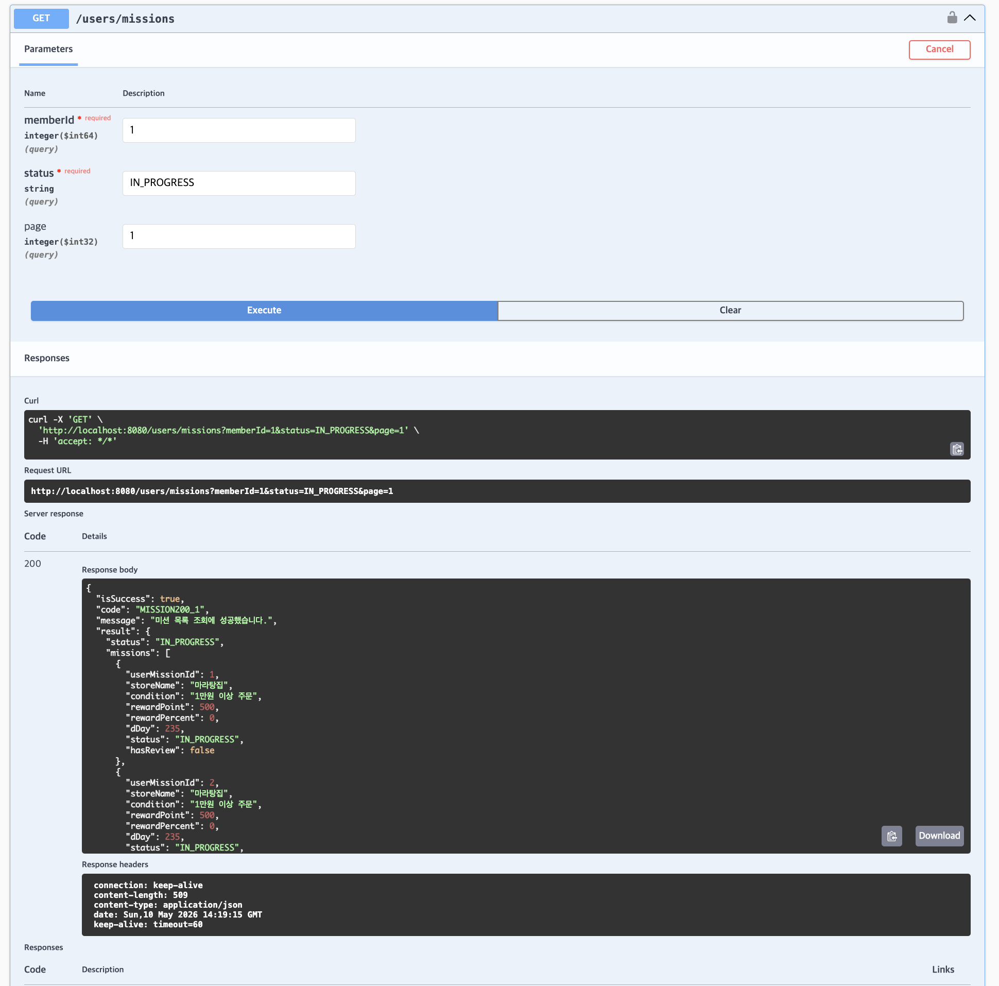
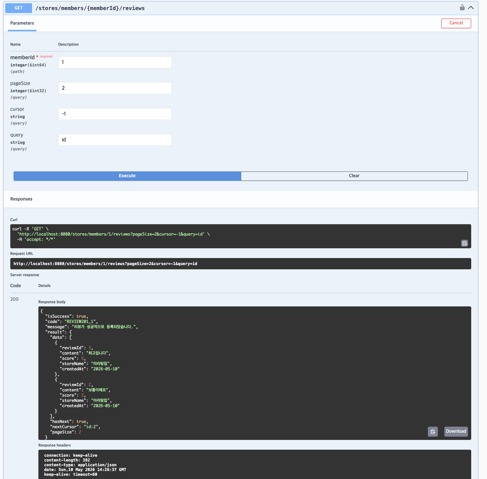
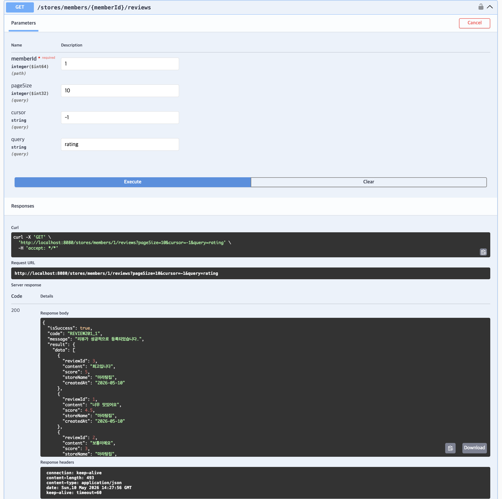
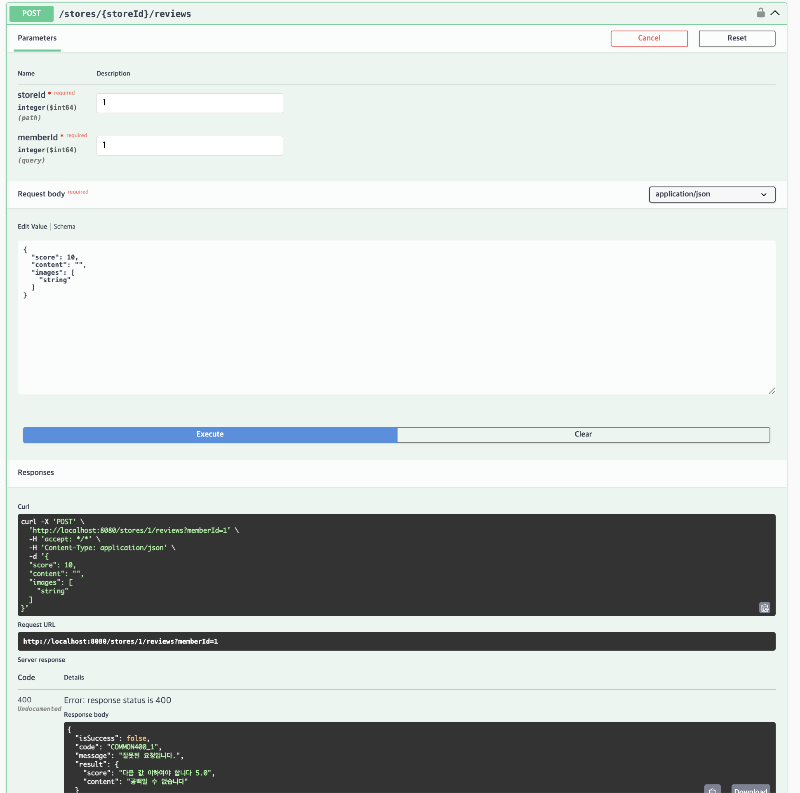

### 핵심 키워드 정리
#### Page와 Slice
Pageable : 페이징 정보를 다루기 위해 Spring Data에서 제공하는 페이지네이션 인터페이스 공통 규격
PageRequest : Pageable를 실제로 구현한 클래스, 페이지 번호와 단일 페이지의 개수를 담을 수 있다.

Spring Data JPA 레포지토리에 Pageable을 전달하면 반환 타입으로 Slice 혹은 Page를 받을 수 있고, 페이지 번호는 0부터 시작 
두 인터페이스 모두 페이지네이션을 통한 조회 결과를 저장하는 역할을 한다. 자세한 내용은 아래에서 설명하겠습니다.

##### Slice
- 별도로 count 쿼리를 실행하지 않고 페이징을 하기 때문에 불필요한 count 쿼리로 인한 성능 낭비가 발생하지 않는다.
- 최근 모바일에서 많이 사용하는 무한 스크롤를 구현할 때 많이 사용한다.
```
// 리포지토리 : 반환 타입을 Slice로 설정
Slice<Item> findSliceByPrice(int price, Pageable pageable);

// 서비스 : 요청 생성 (0페이지부터 5개씩)
Slice<Item> result = itemRepository.findSliceByPrice(5000, PageRequest.of(0, 5));

// 다음 페이지 존재 여부 확인 (무한 스크롤에 최적화)
boolean hasNext = result.hasNext();
```

##### Page
- Page는 Slice를 상속받으므로 Slice의 메서드를 전부 사용 할 수 있다.
- count 쿼리를 실행하여 전체 데이터 개수와 전체 페이지 개수를 계산할 수 있다.
- 흔히 사용하는 게시판 페이지네이션에 적합하다
```
// 리포지토리: 반환 타입을 Page로 설정 
Page<Item> findPageByPrice(int price, Pageable pageable);

// 서비스: 요청 생성 (0페이지부터 5개씩)
Page<Item> result = itemRepository.findPageByPrice(5000, PageRequest.of(0, 5));

//전체 데이터 수와 전체 페이지 수 확인
long totalElements = result.getTotalElements(); // 전체 아이템 개수
int totalPages = result.getTotalPages();        // 전체 페이지 수
```

#### Java stream API
- java 8부터 추가된 기능으로 컬렉션, 배열 등의 요소를 함수형 스타일로 처리할 수 있게 해주는 API
- 반복문을 대체하여 가독성이 높고 병렬 처리를 지원함

특징
- 원본의 데이터를 변경하지 않는다.
- 일회용이다. 만약 닫힌 Stream을 사용한다면 lllegalStateException이 발생한다.
- 내부 반복으로 작업을 처리한다.

Stream API의 3단계
1. 생성하기
- 객체를 생성하는 단계로 재사용이 불가능해서 닫히면 다시 생성해줘야 한다.

2. 가공하기
- 원본 데이터를 별도 데이터로 가공하기 위한 중간 연산으로 연산 결과를 Stream으로 반환하기 때문에 연속해서 중간 연산을 이어갈 수 있다.

3. 결과 만들기
- 가공된 데이터로부터 원하는 결과를 만드는 최종 연산으로 Stream의 요소들을 소모하면서 연산이 수행되므로 1번만 처리가 가능하다.

### 객체 그래프 탐색
객체그래프 : 객체들이 서로 연결되어 있는 전체 구조
- 객체는 참조 관계가 있다면 자유롭게 객체 그래프를 A->B->C 이런 방식으로 참조가 가능하다.
- 하지만 DB의 경우 미리 객체그래프의 범위가 있어야 하고 정해진 범위 외부의 데이터는 탐색할 수 없다.
- 이 두 차이점이 패러다임 불일치이다.

```
// 원래 자바에서는 객체 그래프 탐색으로 연관 관계를 조회 가능
String category = member.getTeam().getCategory().getName();

// 멤버만 조회
Member member = repository.findById(1L); // 실제 쿼리 : SELECT * FROM MEMBER WHERE id = 1; 
member.getTeam().getName(); // 팀 정보가 없어서 에러 발생
```


단방향
- 객체그래프가 한쪽으로 흐르므로 한쪽에선 참조가 가능하지만 한쪽에서는 참조가 불가능
```
// Member -> Team (단방향)
public class Member {
    private Long id;
    private String name;
    private Team team; // Member는 Team을 참조함
}

public class Team {
    private Long id;
    private String name;
    // Team은 Member를 참조하는 변수가 없음
}

member.getTeam() // 가능
team.getMembers() // 참조 불가능하므로 에러
```

양방향
- 객체그래프가 양방향으로 흐르므로 서로 참조 가능하다
```
// Member <-> Team (양방향)
public class Member {
    private Long id;
    private String name;
    private Team team; // Member는 Team을 참조
}

public class Team {
    private Long id;
    private String name;
    private List<Member> members = new ArrayList<>(); // Team에서도 멤버를 참조
}

member.getTeam() // 가능
team.getMembers() // 가능
```

객체참조와 DB사이의 패러다임 불일치는 JPA로 해결 가능합니다
프록시와 지연 로딩을 통해 DB에서 끊겨있던 객체 그래프를 이어줍니다.
```
@Entity
public class Member {
    @Id @GeneratedValue
    private Long id;

    @ManyToOne(fetch = FetchType.LAZY) // @ManyToOne: "객체" 입장의 연관관계 (N:1)를 지연로딩으로 설정
    @JoinColumn(name = "TEAM_ID") // @JoinColumn: DB의 "TEAM_ID" 외래키(FK) 컬럼과 연결
    private Team team; 
}

// 1. JPA를 통해 멤버를 조회 (팀 정보는 안가져옴)
Member member = em.find(Member.class, 1L);

// 2. 멤버 객체에서 팀 객체를 호출, 이떄 프록시를 반환
Team team = member.getTeam(); 

// 3. 이때 실제 Team객체를 호출하여 JPA가 부족한 데이터를 채움
System.out.println(team.getName());
```

### @Valid vs @Validated
@Valid
- 주로 requestbody를 검증하는데 많이 사용된다.
- ArgumentResolver에 의해 처리된다.
- 검증에 오류가 발생할 경우 MethodArgumentNotValidException를 발생시킨다.
- 기본적으로 Controller에서만 동작하며 다른 계층에서 검증이 되지 않는다.

@Validated
- AOP 기반으로 Controller 이외에서 검증이 필요할 때 때 사용한다. (Service까지 검증이 필요한 경우)
- 에러가 발생할 경우 ConstraintViolationException 에러가 발생한다.
- 클래스에 @Validated를 붙여주고 유효성 검증할 파라미터에 @Valid를 붙여주면 유효성 검증이 가능하다.
```
// dto
public class UserRequest {

    @NotBlank(message = "이름은 비어있을 수 없습니다.")
    private String name;

    @Email(message = "유효한 이메일 형식이 아닙니다.")
    private String email;

    ...
}

@Service
@Validated 
public class UserService {

    // @Validated를 사용 시 파라미터에 @Valid 사용
    public void signUp(@Valid UserRequest request) {
        System.out.println("회원가입 성공: " + request.getName());
    }
}
```

### 미션
1. 내가 진행 중인 미션 조회



2. 내가 생성한 리뷰들 조회(커서 기반 페이지네이션, 별점, id 순)





3. RequestBody API에 검증 어노테이션 붙여서 검증하기



