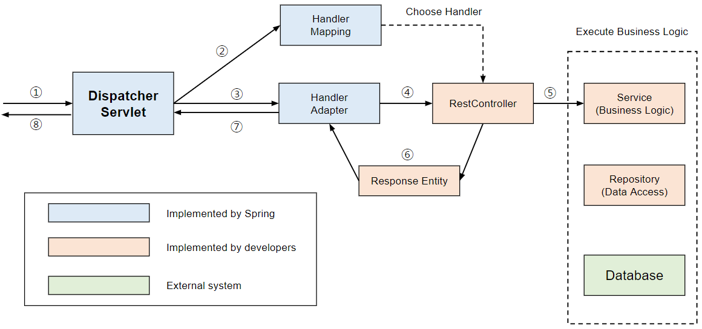
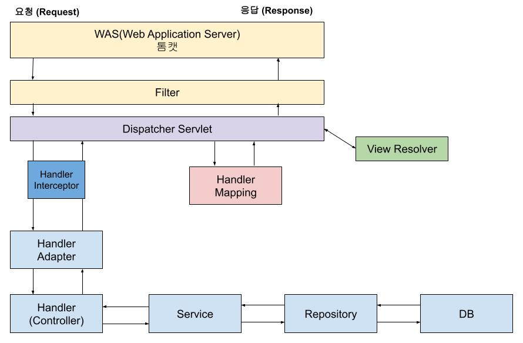

# Chapter03_Spring Boot란?

## 1. 학습 후기
생각보다 내용이 많고 자세하게 설명되어 있어서 흥미롭게 공부하였으나 후반에 갈수록 힘이 빠져서 전체 내용을 이해하는데 시간이 오래 걸린 것 같다. 하지만 스프링부트의 전체적인 구조를 이해하면 앞으로의 학습이 수월해 질 것 같다.
## 2. 핵심 키워드 정리
### SOLID원칙이란?
- SOLID원칙이란 객체 지향 프로그래밍 및 설계에서 코드의 유지보수성, 가독성, 확장성을 높이기 위한 5가지 핵심 설계 원칙입니다.

**1. SRP (Single Responsibility Principle) - 단일 책임 원칙**

- **정의**: "하나의 클래스는 단 하나의 책임만 가져야 한다"는 원칙입니다.
- **핵심**: 클래스를 수정해야 할 이유가 오직 하나뿐이어야 하며, 이를 통해 책임 영역을 명확히 하고 코드 변경에 따른 연쇄적인 수정을 최소화합니다.

**2. OCP (Open-Closed Principle) - 개방-폐쇄 원칙**

- **정의**: "소프트웨어 요소는 확장에는 열려 있어야 하지만, 변경에는 닫혀 있어야 한다"는 원칙입니다.
- **핵심**: 기존 코드를 직접 수정하지 않고도 새로운 기능을 추가할 수 있도록 다형성을 활용하여 설계하는 것이 중요합니다.

**3. LSP (Liskov Substitution Principle) - 리스코프 치환 원칙**

- **정의**: "서브타입은 언제나 자신의 기반 타입(부모 클래스)으로 교체할 수 있어야 한다"는 원칙입니다.
- **핵심**: 자식 클래스는 부모 클래스의 기능을 깨뜨리지 않고 수행할 수 있어야 하며, 상속 관계가 논리적으로 타당해야 합니다.

**4. ISP (Interface Segregation Principle) - 인터페이스 분리 원칙**

- **정의**: "자신이 사용하지 않는 메서드에 의존하도록 강제해서는 안 된다"는 원칙입니다.
- **핵심**: 하나의 범용적인 인터페이스보다는 사용자에 특화된 여러 개의 구체적인 인터페이스로 분리하여 인터페이스 간의 결합도를 낮춥니다.

**5. DIP (Dependency Inversion Principle) - 의존 역전 원칙**

- **정의**: "구체적인 구현체보다는 추상화(인터페이스)에 의존해야 한다"는 원칙입니다.
- **핵심**: 상위 모듈이 하위 모듈에 직접 의존하지 않고 둘 다 추상화에 의존하게 함으로써, 구현체가 바뀌어도 상위 시스템에 영향을 주지 않도록 합니다.

**SOLID 원칙 사용 예시 및 기대 효과**

- **유지보수 용이:** 기능 변경 시 코드 수정 범위를 최소화하여 영향도를 낮춥니다.
- **확장성 향상:** 기존 코드를 거의 변경하지 않고 새로운 기능 추가가 가능합니다.
- **결합도 감소:** 인터페이스를 활용하여 클래스 간 의존성을 낮춥니다.

### DI란?
DI는 IOC(제어의 역전)을 실현하는 방법 중 하나이며 ‘의존성 주입’ 말그대로 객체가 필요로 하는 것을 직접 만드는 대신, 외부에서 주입해주는 방식을말합니다.

DI의 필요성

- 느슨한 결합 방식으로 코드를 작성 할 수 있어 추후 변경과 유지보수에 용이하며 개발자의 부담을 줄여준다.


### Spring에서는 어떤 방식으로 의존성을 주입할 수 있을까?
1.생성자 주입(Constructor Injection) *권장방식

생성자 기반 주입 방식은 컨테이너가 종속성을 나타내는 여러 인수로 생성자를 호출하여 객체를 생성한다.

즉, 객체 생성과 동시의 의존성이 설정된다.
객체의 불변성을 보장한다.
```java
@Service
public class MemberSignupService {
    private final MemberRepository memberRepository;

    /*
    @Autowired
    public MemberSignupService(final MemberRepository memberRepository) {
        this.memberRepository = memberRepository;
    }
     */

		/* 나머지 로직들 */
}
```
또한 생성자는 근본적으로 객체 생성 시 필수적은 의존성(필드값)들을 보장하기 때문에, 의존성이 없는 객체를 만들 수가 없다.

위의 블럭된 코드를 Lombok의 @RequiredArgsConstructor 어노테이션으로 대체할 수 있다.
이 어노테이션이 컴파일 시점에서 생성자를 자동으로 생성해준다.

2.Setter 주입(Setter Injection)

이 방식은 **런타임에 의존성을 주입**하기 때문에, 의존성이 없더라도 객체가 생성이 가능하다.

1. 주입 받으려는 빈의 생성자를 호출하여 빈을 찾거나, 빈 팩토리에 등록
2. 생성된 객체 필드에 @Autowired 어노테이션을 검색
3. 주입받으려는 객체를 세터 메서드를 통해 주입
```java
@Service
public class MemberSignupService {
	private MemberRepository memberRepository;
	
	@Autowired
	public void setMemberRepository(MemberRepository memberRepository) {
			this.memberRepository = memberRepository;
	}
	
	/* 나머지 로직들 */
}

```
선택적으로 의존성 주입이 가능하나, 필수적인 의존성이 주입되어야만 하는 상황에서는 이를 강제할 수 없다.

위의 코드에서도 회원가입을 위한 SignupService에서 DB에서 데이터를 접근하는 Repository를 주입받지 않은 채 작동할 수 있으므로, NullPointException 에러가 발생할 수 있다는 매우 치명적인 단점을 수반한다.

3.필드 주입(Field Injection)

필드 주입 방식 역시 Setter 주입 방식과 마찬가지로,

**런타임에 의존성을 주입하기 때문에, 의존성이 없더라도 객체가 생성될 수 있습니다.**

1. 주입받으려는 빈의 생성자를 호출하여 빈을 찾거나 빈 팩토리에 등록
2. 생성된 객체 필드에 @Autowired 어노테이션을 검색
3. 주입받으려는 객체를 필드에 주입
```java
@Service
public class MemberSignupService {
		**@Autowired
		private MemberRepository memberRepository;**
	
	/* 나머지 로직들 */
}
```
단점
1. 코드가 단순해지지만, 필드에 직접 주입되기에 테스트 중에 의존성 주입이 어렵다.
2. 명시적으로 드러나는 의존성이 없어, 의존성 구조 이해가 어렵다.
3. 의존성 관계가 드러나지 않아, 순환 참조 문제가 발생할 수 있다.

### IoC란?
프로그램의 제어 흐름을 직접 제어하는 것이 아니라 외부에서 관리하는 것을 IOC 다른말로 '제어의 역전'이라고 합니다.

**일반적인 개발 환경에서는 모든 프로그램의 제어를 개발자가 하는 반면, 프레임워크를 사용하는 개발환경에서는 실행 흐름을 전적으로 프레임워크에 일임하는 형태가 됩니다.**

이처럼 개발자가 작성한 객체나 메서드의 제어를 개발자가 아니라, 외부의 위임하는 설계 원칙을 제어의 역전 이라고 합니다.

**Spring IoC 컨테이너**

Spring IoC 컨테이너는 Bean의 생성과 관리를 개발자가 아닌 Spring 프레임워크가 담당하는 개념이다.

IoC 컨테이너의 작동 방식

1. 객체를 class로 정의한다.
2. 객체들 간의 연관성 지정: Spring 설정 파일 또는 어노테이션을 통해 객체들이 어떻게 연결될지(의존성 주입) 지정한다.
3. IoC 컨테이너가 이 정보를 바탕으로 객체들을 생성하고 필요한 곳에 주입한다.

IoC 컨테이너는 위의 일련의 과정을 거쳐서 POJO 기반의 개발을 가능하게 해주는데

POJO(Plain Old Java Object)는 라이브러리나 프레임워크에 의존하지 않고, 순수한 자바 객체를 의미한다

Spring은 POJO 기반의 개발을 지향하며, 이는 프레임워크에 종속적이지 않고 일반적인 자바 객체를 사용하여 우리의 비즈니스 로직을 구현할 수 있다.

### 생성자 주입 vs 수정자, 필드 주입 차이는?
- **생성자 주입 vs 수정자, 필드 주입 차이는?**
1. 생성자 주입
   - **특징:** 생성자 호출 시점에 1회 호출, `final` 키워드 사용 가능.
   - **장점:** 불변성 보장, 필수 의존성 누락 시 컴파일 에러 발생, 순환 참조 방지.
   - **권장:** 스프링에서 가장 권장되는 방식.
2. 수정자 주입
   - **특징:** Setter 메서드를 통해 의존성 주입.
   - **장점:** 선택적이거나 변경 가능한 의존성에 유리.
   - **단점:** 주입된 객체가 변할 수 있음, 필수 의존성 누락 시 NPE 위험.
1. 필드 주입
   - **특징:** 필드에 직접 `@Autowired` 어노테이션 사용.
   - **장점:** 코드가 매우 간결함.
   - **단점:** 외부에서 변경이 불가능(테스트 어려움), 스프링 프레임워크에 강하게 의존, 순환 참조 오류가 발생할 수 있음, 의존성 구조의 확인이 어려움

### AOP란?
AOP란 핵심 비즈니스 로직에서 로깅, 트랜잭션, 보안 등 공통적인 부가 기능을 분리하여 모듈화하는 프로그래밍 방식입니다.

Spring에서의 AOP

AOP의 구성요소

- **어드바이스(Advice)**: 부가 기능. 특정 로직의 실행 지점 전, 후 등에 실행할 액션
- **조인포인트**: 클라이언트가 호출하는 모든 비즈니스 메소드
- **포인트 컷(Pointcut)**: 어드바이스가 적용될 위치를 선별하는 기능

AOP를 적용하기 위한 방법은 세 가지로 나뉩니다.

- 컴파일 시점
- 클래스 로딩 시점
- 런타임 시점(프록시 방식)

여기서 Spring AOP은 클래스 로딩 시점을 지원하고 있습니다. 그 외의 방식은 AspectJ를 통해서만 가능합니다. AspectJ는 더 광범위한 AOP 지원을 제공하는 독립적인 프레임워크입니다.

AOP의 기본 원리

1. @Aspect를 통해 어드바이저를 만들 클래스를 지정한다.
2. 포인트컷 어노테이션을 통해 적용할 범위를 지정한다.
3. 포인트컷 어노테이션이 적용된 메소드에서 부가 로직을 서술한다.

AOP 제작 순서

1. **생성**: 스프링 빈 대상이 되는 객체를 생성한다. ( @Bean , 컴포넌트 스캔 모두 포함)
2. **전달**: 생성된 객체를 빈 저장소에 등록하기 직전에 빈 후처리기에 전달한다.
3. **Advisor 빈 조회:** 스프링 컨테이너에서 Advisor 빈을 모두 조회한다.
4. **@Aspect Advisor 조회**: @Aspect 어드바이저 빌더 내부에 저장된 Advisor 를 모두 조회한다.
5. **프록시 적용 대상 체크**: 앞서 3, 4에서 조회한 Advisor 에 포함되어 있는 포인트컷을 사용해서 해당 객 체가 프록시를 적용할 대상인지 아닌지 판단한다. 이때 객체의 클래스 정보는 물론이고, 해당 객체의 모든 메서드 를 포인트컷에 하나하나 모두 매칭해본다. 그래서 조건이 하나라도 만족하면 프록시 적용 대상이 된다. 예를 들어 서 메서드 하나만 포인트컷 조건에 만족해도 프록시 적용 대상이 된다.
6. **프록시 생성**: 프록시 적용 대상이면 프록시를 생성하고 프록시를 반환한다. 그래서 프록시를 스프링 빈으로 등 록한다. 만약 프록시 적용 대상이 아니라면 원본 객체를 반환해서 원본 객체를 스프링 빈으로 등록한다.
7. **빈 등록**: 반환된 객체는 스프링 빈으로 등록된다.

### 서블릿이란?
**자바를 기반으로 웹 페이지를 동적으로 생성하는 서버 측 프로그램**으로, 클라이언트의 HTTP 요청을 받아 비즈니스 로직을 처리하고 그 결과를 다시 HTML 형태 등으로 응답하는 자바 클래스입니다

Spring의 DispatchServlet

HTTP 프로토콜로 들어오는 모든 요청을 가장 먼저 받아 적합한 컨트롤러에 위임해주는 프론트 컨트롤러 입니다.

하지만 모든 요청을 처리하다 보니 이미지나 정적 파일에 대한 요청마저 모두 가로채는 까닭에 정적 자원을 불러오지 못하는 문제가 발생하였는데 이를 해결하기 위해 요청에 대한 컨트롤러를 먼저 찾고, 찾지 못한 경우에, 2차적으로 설정된 자원 경로를 탐색하여 자원을 탐색하는 방법을 이용하게 되었다.

DispatchServlet의 동작 방식

DispatchServlet은 적합한 컨트롤러와 메서드를 찾아 요청을 위임해야 한다.

처리 과정

1. 클라이언트의 요청을 DispatchServlet이 받음
2. 요청 정보를 통해 요청을 위임할 컨트롤러를 찾음
3. 요청을 컨트롤러로 위임할 핸들러 어댑터를 찾아서 전달함
4. 핸들러 어댑터가 컨트롤러로 요청을 위임함
5. 비즈니스 로직을 처리함
6. 컨트롤러가 반환값을 반환함
7. 핸들러 어댑터가 반환값을 처리함
8. 서버의 응답을 클라이언트로 반환함
## 3.  미션
## 핵심 키워드 정리 후, 스프링의 전반적인 요청, 응답 흐름을 설명하세요
### 스프링의 구조와 요청 흐름

1.WAS에서 Request가 들어오면 서블릿 객체의 생명주기를 관리하는 Servlet Container로 전송해 응답, 요청 객체를 생성합니다.

1-1. Servlet Container내의 단일 서블릿 객체인 DispatcherServlet에 요청이 도달하기 전 Filter가 먼저 요청을 받아 요청에 대한 인증, 권한을 체크합니다.

2.web.xml을 기반으로 사용자가 요청한 URL이 어느 Servlet에 대한 요청인지 찾습니다.

2-1. 해당 서블릿이 메모리에 없을 경우 init()을 통해 생성하고, 서블릿이 변경되었을 경우 destroy() 후 init()을 통해 새로운 내용을 적재합니다. 이때 서블릿 객체는 '싱글톤'으로 관리합니다.
싱글톤: 생성자가 여러 차례 호출 되더라도 실제 생성 객체는 하나이고 생성 이후 호출되는 생성자는 이미 생성된 객체를 리턴한다.

2-2. DispatcherServlet은 해당 HTTP Request를 Handler Mapping을 통해 요청에 따른 적절한 Handler와 그 Handler를 실행할 수 있는 Handler Adapter를 찾습니다.

2-3.Handler Adapter는 요청에 알맞는 Controller(Handler)를 호출합니다.
*Handler Intercepter: Handler Adapter에 도달하기 전 요청을 가로채 로그 기록이나 공통 설정 등 공통 로직들을 처리해 비즈니스 로직을 분리하는 역할을 합니다.

4.해당 Controller에서 service() 메서드를 호출한 후, 클라이언트의 비즈니스 로직여부에 따라 메서드를 호출해 실행한 후 결과를 반환합니다.

4-1. Repository는 객체에 의해 생성된 데이터베이스 테이블에 접근하는 메서드들(findAll, save등)을 사용하기 위한 인터페이스이다. Repository에는 데이터 처리를 위한 CRUD가 실행 될 때 이것을 처리할 메서드가 정의되어 있다.

5.해당 로직들을 수행한 후 호출할 View와 Data를 Dispatcher Servlet에 전달합니다.

6.Dispatcher Servlet이 전달받은 것을 View Resolver에게 전달하고 동적 뷰를 전달받습니다.(클라이언트가 요청 받고 싶은 값이 html이 아닌 View Resolver를 거치지 않습니다.)

7.요청받은 값은 Filter→WAS를 거쳐 사용자에게 화면이나 데이터를 출력합니다.

## 스프링 헤체 분석기 시리즈를 통해 구조 학습하기 
## 필터

### 필터가 하는 행동

- 요청을 정해진 로직대로 처리
- 인증 객체 생성

### 필터 구조

init: 초기 설정
doFilter: 필터 실행
destory: 필터 객체 삭제

### 필터 로직

스프링에서 필터는 배열 형태로 사전에 정해진 순서대로 실행하는데 이 형태를 FilterChain이라고 합니다.

FilterChain이 인덱스를 늘려가면서 doFilter를 실행하게 되는 구조인데 어떤 식으로 실행하게 되냐면
FilterChain에서 filter.doFilter()를 통해 필터 로직 실행 → Filter이 doFilter를 실행 마지막에 filterChain.doFilter를 실행해 다시 FilterChain을 불러오는 구조입니다.

### 필터 로직 종류

### ApplicationFilterChain

FilterChain의 구현체로, 설정한 Filter의 정보가 담겨있습니다.
필터들의 흐름을 제어하며 요청이 들어올 때 먼저 호출되는 FilterChain이다.
호출을 받으면 미리 생성된 Filter들이 리스트를 돌리면서 실행하게 된다.

기본적으로 ApplicationFilterChain에 있는 필터

- CharacterEncodingFilter: 요청, 응답의 인코딩 방식을 설정하는 필터
- FormContentFilter: POST 제외 요청도 파라미터를 읽을 수 있도록 하는 필터
- RequestContextFilter: 요청을 바인딩, 모든 계층에서 요청 정보를 조회할 수 있도록 하는 필터
- WsFilter: 웹소켓 연결 요청을 처리하는 필터

스프링 시큐리티 의존성을 활성화 하면 SpringSecurityFilterChain이 들어가고
커스텀 필터를 생성해도 여기에 들어가게 됩니다.
생성 시 반드시 doFilter를 오버라이드 해야하고 마지막은 chain.doFilter()로 끝나야 합니다.

커스텀 필터를 만들기 위한 Interface

### GenericFilterBean

기본이 되는 FilterChain 인터페이스로 Bean을 생성, 초기화, 등록하는 메서드를 정의합니다.
Filter도 Bean형태로 객체를 생성하고 사용해야 합니다.

이렇게 만든 Filter는 스프링 IoC 컨테이너인 ApplicationContext에서 관리하지 않습니다.
톰캣 서버의 서블릿 컨테이너에서 관리하게되는데, 내부적으로 또 이름을 ApplicationContext(이름은 같지만 다른 컨테이너)를 사용합니다.

Filter등록 시에는 @Configuration, @Bean을 이용한 방식(명시적 빈 생성)으로 등록하고 나중에 사용 시에는 FilterChain에서 Bean의 이름을 조회해서 doFilter를 실행합니다.

### OncePerRequestFilter

위에서 설명한 GenericFilterBean을 상속받으며 요청 한번 당 한번만 Filter가 실행되도록 보장합니다.

내부적으로 반드시 doFilterInternal 메서드를 구현해야하며 해당 메서드를 통해 요청 당 한번만 실행되는 것을 보장합니다.
FilterChain(filter.doFilter()) → OncePerRequestFilter(doFilterInternal) → 해당필터(doFilterInternal) 과 같은 흐름으로 실행됩니다.

### SpringSecurityFilter

스프링 시큐리티를 사용할때 기본적으로 등록되는 Filter들입니다.
DelegationFilterProxy - FilterChainProxy - SecurityFilterChain

Filter.doFilter() → DelegatingFilterProxy → springSecurityFilterChain → Filter
순차 실행이고 돌아올 때도 동일한 방향으로 작동합니다.
이때 스프링의 Repository를 주입받는 상황이 많은데 Filter는 스프링 Application Context의 범위를벗어나 있어서 주입을 받지 못하는데
이때 DelegatingFilterProxy가 필터와 스프링 Application Context를 연결해주는 다리역할을 해서 Repository를 주입 받을 수 있도록 만들어준다.

## 서블릿 구조
ApplicationFilterChain에서 마지막에 service()를 호출했어요 그러면서 요청이 서블릿으로 넘어 갔습니다. 이때 앞의 DispatcherServelt이 아닌 HttpServlet과 FrameworkServlet에도 요청이 보내진다 이것은 무엇일까?

### HttpServlet

HTTP 메서드를 처리하는 기능들 지원합니다.
서블릿의 service메서드가 각각의 메서드를 감지해서 분기처리를 합니다.

### FrameworkServlet

Application Context 과  HttpServlet 기능을 같이 구현하고 있으며
주 기능은 Application Context를 이용해 Bean을 관리합니다.

이때 Application Context는 자식 컨테이너인 Servlet Application Context와 부모 컨테이너인 Root Application Context로 구분됩니다. 이 둘은 상속 관계가 아닌 객체 간의 부모-자식관계입니다. 빈을 찾는 요청이 들어오면 자식 → 부모 순서로 탐색합니다.
이렇게 나눠지는 이유는 역할 분담과 재사용성이 목적입니다.

### DispatcherServlet

FrameworkServlet을 상속하며 필터를 거치고 온 요청을 처음 받아 처리하는 서블릿입니다.

흐름 순서

- FilterChain에서 service 호출 하지만 Dispatcher Servlet이 아닌 HttpServlet으로 이동합니다
    - 타겟은 Dispatcher Servlet이 맞으나 service 메서드를 오버라이드 하지 않습니다.
- HttpServlet의 service메서드 에서 요청 응답 객체를 확장합니다.
- FrameworkServlet의 service를 실행해서 다시 HttpServlet으로 보내 분기처리합니다.
- HttpServlet에서 HTTP메서드를 판단하고 FrameworkSetvlet에서 Application Context를 세팅하고 그 다음 DispatcherServlet의 doService 메서드를 호출합니다.
- doService에서 요청 전처리 과정을 거치고 doDispatch 메서드를 실행합니다.
- doDispatch 메서드에서는 HandlerMapping을 통해 들어온 요청을 처리할 Controller를 찾고, HandlerAdapter를 통해 Controller(Handler)에게 요청을 전달, 응답을 받아 후처리를 하는 로직을 전달, 진행하게 됩니다.

## 핸들러 구조
### HandlerMapping

DispatcherServlet → getHandler() → 지원하는 Handler 탐색 → 리턴

- 등록된 HandlerMapping들을 가지고 해당 요청을 처리할 수 있는 Handler를 찾습니다.
- 그 중, @RequestMapping 어노테이션을 처리할 수 있는 RequestMappingHandlerMapping핸들러 매핑이 탐색을 진행합니다.
    - MappingRegistry에 매핑 정보들 (URI, 메서드, 파라미터) 가 담겨있음
    - @RequestMapping 어노테이션이 붙은 경우, 초기화 과정에서 요청 정보가 생성, 저장됨
    - HandlerMapping이 MappingRegistry 정보들을 탐색, 정보를 가져옴
- 찾은 Handler를 실행하려면 Handler Adapter를 통해 실행합니다.

### HandlerAdapter

etHandler() → getHandlerAdapter() → ha.handle() → Controller 요청

이 과정을 거쳐 찾은 Controller(Handler)을 실행합니다.

왜 굳이 번거롭게 HandlerAdapter로 실행할까?

Controller구현 방법이 하나가 아니기 때문입니다.

1. @Controller, @RequestMapping 어노테이션들을 이용해 구현
2. Controller 인터페이스 상속
3. HttpRequestHandler 상속
4. HttpServlet 상속 (직접 서블릿 생성)

HandlerAdapter는 다음과 같이 동작합니다.

- 실행할 Handler의 Bean을 조회 혹은 생성
- Handler의 메서드를 invoke해 실행

기본적으로 HandlerAdapter들은 다음과 같습니다.

- RequestMappingHandlerAdapter: @RequestMapping 어노테이션으로 구현한 Handler 처리 (주로 사용)
- HandlerFunctionAdapter: 함수형 핸들러를 처리
- HttpRequestHandlerAdapter: HttpRequestHandler 상속한 Handler 처리
- SimpleControllerHandlerAdapter: Controller 상속한 Handler 처리

RequestMappingHandlerAdapter 중심 흐름

- 컨트롤러 실행 전 인터셉터의 preHandle를 호출합니다. 만약 여기서 false 를 반환하면 즉시 중단되고, 이후의 인터셉터나 컨트롤러는 실행되지 않습니다.
- 모든 인터셉터가 true를 반환하면 RequestMappingHandlerAdapter 가 동작합니다.
- handleInternal 메서드가 세션이 필요한지 확인합니다. 없다면 바로 invokeHandlerMethod메서드를 실행해 요청 파라미터 바인딩과 결과를 담는 ModelAndViewContainer을 생성합니다.
- 이후 invokeAndHandle 메서드를 실행해 컨트롤러 메서드 호출, 응답 상태 코드 처리를 실행합니다.
- 마지막으로 Bean을 가져와 invoke 하는 과정과 스프링 AOP과정을 거쳐 응답을 생성합니다.
- JSON형태의 응답을 리턴하고 DispatcherServlet으로 이동합니다. JSON형식이 아니면 데이터 가공과정이 필요합니다.
- 응답에 대해 postHandle 메서드를 거쳐 afterCompletion메서드를 실행해 응답을 생성합니다.
## 4.  워크북의 내용을 제외한 추가 정보 학습의 경우 md파일에 추가 작성합니다.

